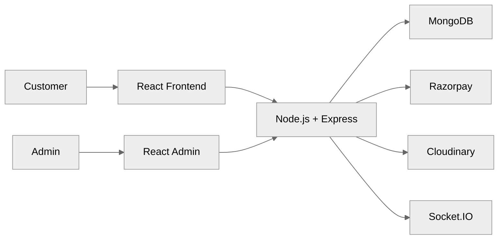
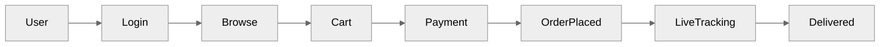

# 🍽️ Resto-Management — Full-Stack Restaurant Management System


A **production-ready full-stack restaurant management system** built with the **MERN stack**, featuring **real-time order updates, online payments, admin dashboard, and WhatsApp notifications**.

---

# 🚀 Overview

Resto-Management allows customers to:

- Browse food menu
- Add items to cart
- Place orders securely
- Pay using Razorpay
- Track order status in real time

Admins can:

- Manage menu items
- Upload food images
- Update order status
- Monitor all orders live

---

# ✨ Features

## 👤 Customer Features

- 🔐 JWT Authentication
- 🍔 Browse & search food items
- 🛒 Cart management
- 💳 Razorpay online payments
- 📦 Place orders
- 🔄 Live order tracking

---

## 🛠️ Admin Features

- ➕ Add / Edit / Delete food items
- 🖼️ Upload images via Cloudinary
- 📊 View all orders
- 🔄 Update order status in real time

---

## ⚡ Real-Time Features

- Live order updates using Socket.IO
- Instant status synchronization
- Admin & customer live communication

---

## 📱 Notifications

- WhatsApp notifications for:

  - Order confirmation
  - Order updates

---

# 🧠 System Architecture



---

# 👤 User Flow



---

# 🛠️ Tech Stack

## Frontend
- React
- Vite
- Axios
- Socket.IO Client

## Backend
- Node.js
- Express.js
- MongoDB
- Mongoose
- JWT Authentication

## Admin Panel
- React
- Vite
- Socket.IO Client

## Payments
- Razorpay

## Storage
- Cloudinary

## Notifications
- WhatsApp Web API

## DevOps

- Render
- Vercel

---

# 📁 Project Structure

```
backend/
frontend/
admin/
```

---

# ⚡ Key Highlights

- Full MERN stack implementation
- Real-time order tracking
- Secure online payments
- Admin dashboard
- Cloud image upload
- Production-ready architecture

---

# 🚀 Run Locally

## 1️⃣ Clone

```bash
git clone https://github.com/sourodip19/Resto-Management.git
cd Resto-Management
```

---

## 2️⃣ Backend

```bash
cd backend
npm install
npm run server
```

Runs on:

```
http://localhost:4000
```

---

## 3️⃣ Frontend

```bash
cd frontend
npm install
npm run dev
```

Runs on:

```
http://localhost:5174
```

---

## 4️⃣ Admin Panel

```bash
cd admin
npm install
npm run dev
```

Runs on:

```
http://localhost:5175
```

---

# 🔐 Environment Variables

Backend `.env`

```
PORT=4000
MONGODB_URI=your_mongodb_uri
JWT_SECRET=your_secret

CLOUDINARY_CLOUD_NAME=your_name
CLOUDINARY_API_KEY=your_key
CLOUDINARY_API_SECRET=your_secret

RAZORPAY_KEY_ID=your_id
RAZORPAY_KEY_SECRET=your_secret
```

---

# 🌐 Live Demo

Customer App:

https://resto-management-frontend.vercel.app/

---

# 👨‍💻 Author

**Sourodip Dey**

GitHub: https://github.com/sourodip19

---

# ⭐ Why this project matters

This project demonstrates:

- Full-stack development
- Payment gateway integration
- Real-time systems
- Production-level architecture
- Admin dashboard development

---

# ⭐ Support

If you like this project, give it a ⭐ on GitHub.

---

**Made with ❤️ by Sourodip Dey**