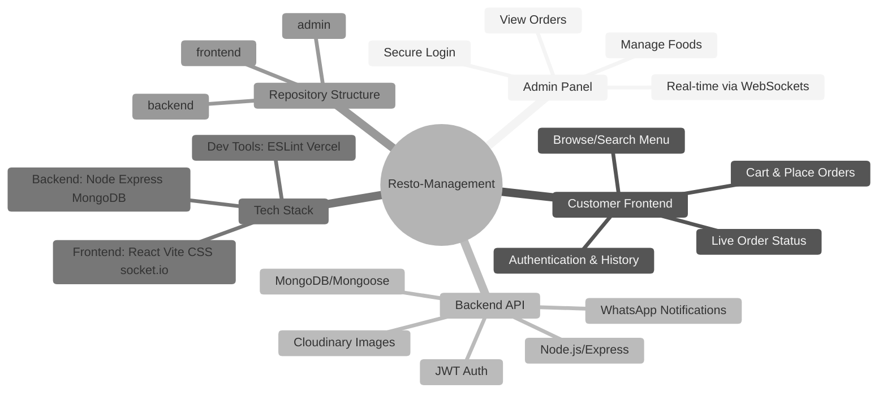

# Resto-Management 🍽️

A full-stack restaurant management system built with the **MERN** stack (Node.js, Express, MongoDB, React) plus real-time communication, payment integration, and WhatsApp notifications. This project consists of three separate applications in a mono‑repo:

- **backend/** – REST API with authentication, food, cart and order management
- **frontend/** – Customer-facing React app for browsing food & placing orders
- **admin/** – Admin dashboard React app for managing menu & orders


## 🧩 Visual Overview

To quickly grasp the architecture, here's a mind map illustrating the core parts of the system:



---

## 🚀 Features

- 🔐 User registration & login with JWT authentication
- 🛒 Shopping cart: add/remove items, quantity tracking
- 📦 Place orders with address form and cart review
- 💳 Razorpay payment gateway integration with signature verification
- 🔄 Real‑time order status updates using **Socket.IO**
- 📱 WhatsApp notifications to customer & admin (local development only)
- 📝 Search for menu items with regex query
- 📁 Cloudinary image uploads for food items via multer memory storage
- 🛠️ Admin panel: add/update/remove food items, toggle availability
- 📊 Admin order list with live updates and status control

---

## 🏗️ Architecture & Folder Structure

```
/ (root mono-repo)
├─ backend/             # Express API server
│  ├─ config/           # DB & Cloudinary config
│  ├─ controllers/      # Route handlers (Food, User, Cart, Order)
│  ├─ middleware/       # JWT authentication
│  ├─ models/           # Mongoose schemas (User, Food, Order)
│  ├─ routes/           # Express routers
│  ├─ utils/            # WhatsApp client helper
│  └─ server.js         # App entrypoint + Socket.IO setup
├─ frontend/            # Customer React app (Vite)
│  ├─ public/           # Static assets
│  ├─ src/
│  │  ├─ components/    # Reusable UI components
│  │  ├─ context/       # React context for global state
│  │  ├─ pages/         # Route views (Home, Cart, Order, etc.)
│  │  ├─ socket.js      # Socket.IO client wrapper
│  │  └─ main.jsx       # App bootstrap
├─ admin/               # Admin React app (Vite)
│  ├─ public/
│  ├─ src/
│  │  ├─ components/    # Navbar, Sidebar, protected routes, etc.
│  │  ├─ pages/         # Add, Edit, List, Order, Login
│  │  ├─ socket.js
│  │  └─ main.jsx
└─ README.md
```

Each sub-project is self-contained with its own `package.json` and can be started independently.

---

## 🛠️ Tech Stack

| Layer        | Technologies                                                          |
|--------------|-----------------------------------------------------------------------|
| Backend      | Node.js, Express, MongoDB (Mongoose), JWT, Multer, Cloudinary         |
| Frontend     | React 19, Vite, React Router v7, axios, socket.io-client, react-icons |
| Admin Panel  | React, Vite, lodash, react-toastify, socket.io-client                 |
| Payments     | Razorpay API                                                         |
| Notifications| whatsapp-web.js (local dev only)                                     |
| Dev tooling  | ESLint, nodemon, dotenv, Vite, Git                                   |

---

## 🎯 Key Learnings

- Building a **monorepo** with separate client/server directories helps isolate concerns while sharing concepts.
- Using **Multer memory storage** to stream images directly to Cloudinary avoids storing uploads locally.
- Implementing **JWT-based authentication** and securing routes with middleware.
- Integrating **Razorpay** illustrates signature verification and handling webhooks.
- Leveraging **Socket.IO** for real‑time updates (orders, availability) between clients and server.
- Sending automated **WhatsApp messages** using whatsapp-web.js during development.
- Managing environment variables and CORS for multiple origins across apps.
- Learning to structure React apps with **context**, **pages**, and reusable components.
- Understanding how to toggle item availability and maintain cart state in a user document.

---


---

## 💻 Installation & Setup

1. **Clone repository**
   ```bash
   git clone https://github.com/sourodip19/Resto-Management.git
   cd Resto-Management
   ```

2. **Backend**
   ```bash
   cd backend
   npm install
   ```
   - Create a `.env` file with:
     ```ini
     PORT=4000
     MONGODB_URI=<your_mongo_connection_string>
     JWT_SECRET=<secret>
     CLOUDINARY_CLOUD_NAME=<name>
     CLOUDINARY_API_KEY=<key>
     CLOUDINARY_API_SECRET=<secret>
     RAZORPAY_KEY_ID=<id>
     RAZORPAY_KEY_SECRET=<secret>
     FRONTEND_URL=http://localhost:5174
     FRONTEND_ADMIN_URL=http://localhost:5175
     ADMIN_WHATSAPP=<91XXXXXXXXXX>
     ```
   - Start server: `npm run server`

3. **Frontend (Customer)**
   ```bash
   cd ../frontend
   npm install
   npm run dev   # runs on http://localhost:5174 by default
   ```

4. **Admin Panel**
   ```bash
   cd ../admin
   npm install
   npm run dev   # runs on http://localhost:5175
   ```

> ⚠️ Ensure backend is running before using either client.

---

## 📦 Deployment

Each app can be deployed separately (e.g. Vercel for frontend/admin, Heroku/Render for backend). Environment variables must be configured accordingly.

**Live demo (customer frontend):** https://resto-management-frontend.vercel.app/

---

## 📝 Notes

- WhatsApp integration works only in local development mode; messages are disabled in production.
- The admin panel uses protected routes; login token is stored in `localStorage`.
- Search endpoint returns an empty array when query is missing to avoid errors.

---

## 📚 Credits & Inspirations

- Built for learning full-stack development and payment/notification integrations.
- Menu images stored on Cloudinary; orders updated via Socket.IO.

---

Thanks for exploring! Feel free to 💡 propose enhancements or report issues.

---

**Author:** Sourodip Dey ⭐️  
_If you find this project useful, please give it a star!_
